# Android Studio #

## Android Studio 介绍 ##

### 为什么使用AS?###
 * 官方推荐的工具就是AS;
 * Google已经宣布将在2015年底终止Eclipse工具的开发与支持。这包括ADT插件、Ant构建系统、DDMS、Traceview与其他性能和监控工具;
 * 众多开源软件都是使用AS构建;

### 官网 ###
[Android Studio官网](https://developer.android.com/studio/index.html)

### 介绍 ###
见官网
### 用户指南 ###
[User Guide](https://developer.android.com/studio/intro/index.html)
### AS和Eclipse对比 ###
高大上,智能贴心,想用不容易
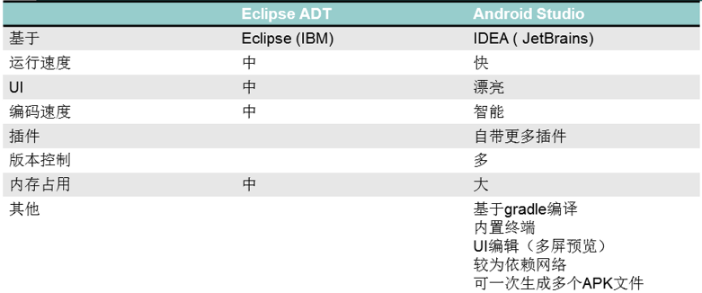


### 相关网站 ###
* [Android Studio中文社区](http://www.android-studio.org/)
* [Android Studio Project Site](http://tools.android.com/)
* [Android开发工具国内站点](http://www.androiddevtools.cn/)
* [IntelliJ IDEA文档](http://www.jetbrains.com/idea/help/android-reference.html)
* [Gradle官网](https://gradle.org/)
* [Gradle用户手册](https://docs.gradle.org/current/userguide/userguide.html)
* [Gradle Android 插件参考](http://google.github.io/android-gradle-dsl/current/index.html)

## Android Studio的安装 ##
### 1. JDK1.8安装

### 2. 解压安装AS的绿色解压包
> 注意：
> 1. 安装路径最好不要包含中文和特殊字符，不可以有空格

### 3. 配置项目的SDK和JDK路径

## AS安装过程中目录介绍 ##
### AS目录结构 ###
* bin/studio64.exe：64位系统启动项
* bin/studio64.exe.vmoptions：64位系统启动时的虚拟机配置
* bin/studio.exe：32位系统启动项
* bin/studio.exe.vmoptions：32位系统启动时的虚拟机配置
* bin/idea.properties: AS相关启动配置
* gradle/m2repository:AS自带的默认仓库
* gradle/gradle-xxx: gradle编译器
* plugin: AS自带的插件目录

### SDK目录 ###

* build-tools: 编译工具目录
* platforms： 编译版本的目录
* extra: android support 包相关

###.AndroidStudio版本号目录 ###
主要保存Android Studio设置相关的文件（包含插件）

## AS用户界面 ##
* 菜单栏
* 工具栏
* Tool Buttons


## AS设置 ##
### 主题设置，窗体动画开关（熟悉）
* 主题设置
* 系统字体样式和大小设置
* 窗体动画开关（__建议关闭__）
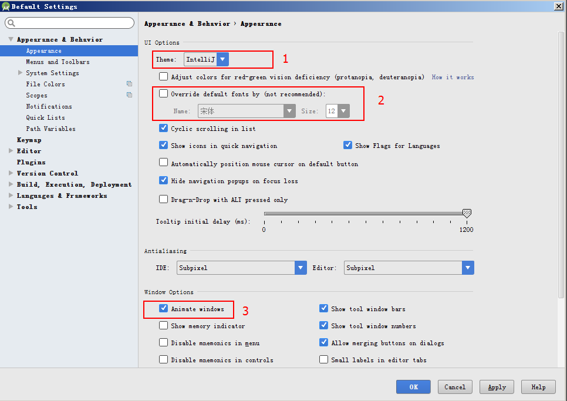 

### 关闭默认打开最近项目（熟悉）
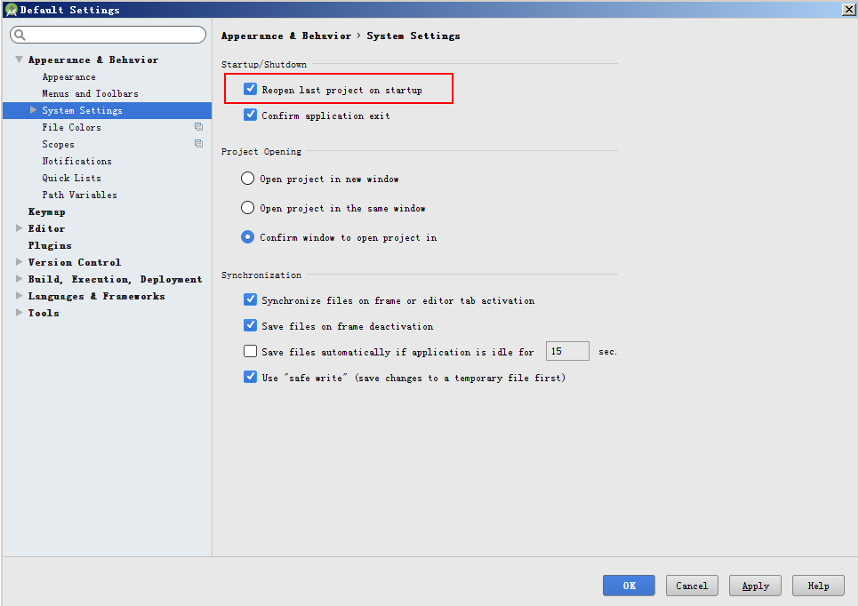 

### 禁用AS的自动更新(重要)
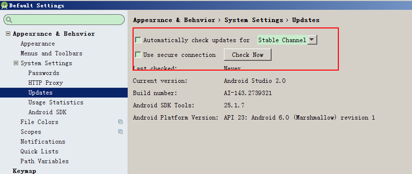

### 开发环境设置（重要）
JDK,SDK,NDK配置
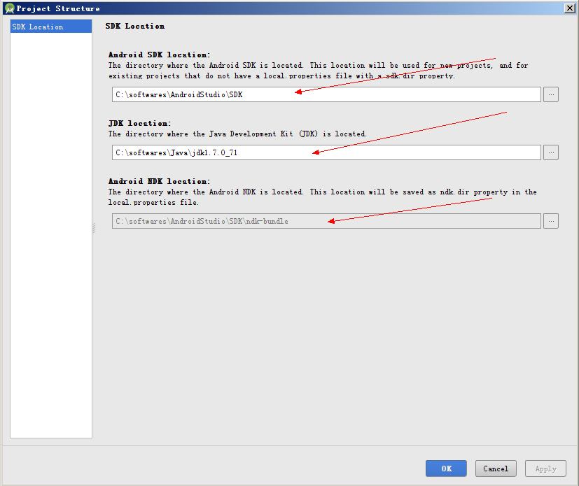

### 自动导包(熟悉)
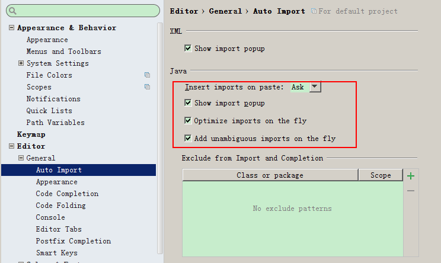

### 代码智能提示（熟悉）
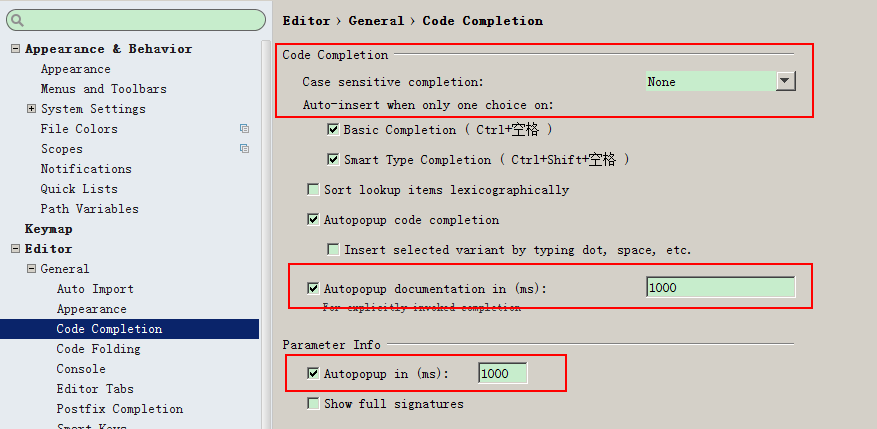

### Postfix Completion ###

### 文件模板 ###

```
/*
 *  创建者:   ${USER}
 *  创建时间:  ${DATE} ${TIME}
 *  描述：    TODO
 */
```

### 字符集（重要）
__全部为utf-8__
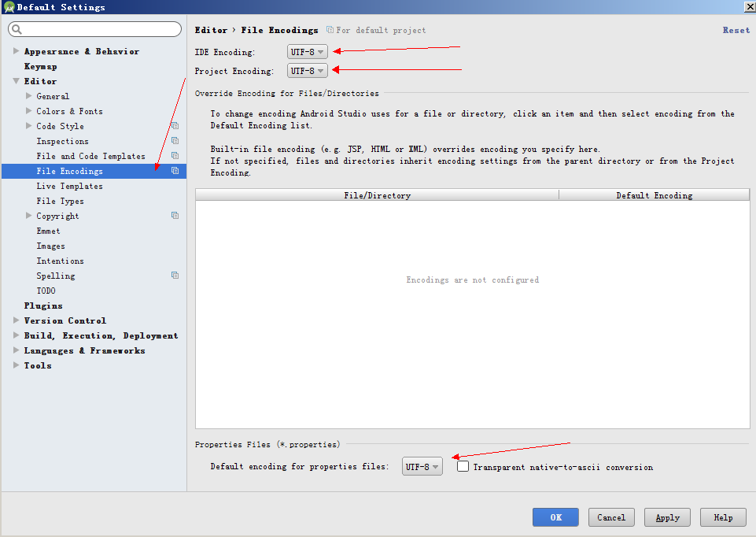

### Live Templates ###


### 优化AS编译运行时设置(实用)
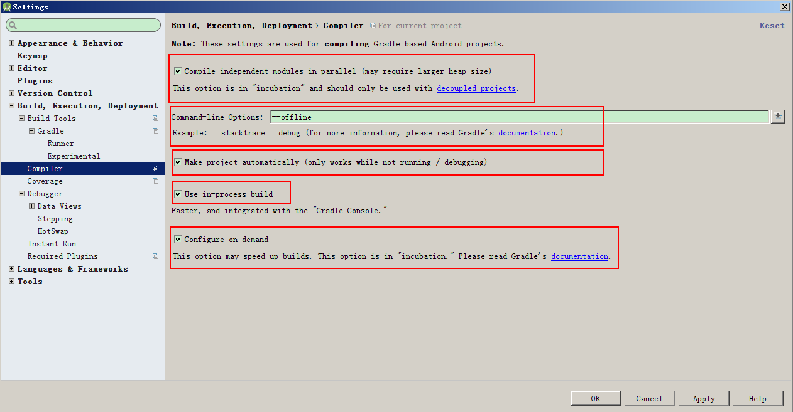

### 插件的使用 ##
带google开头的关闭

[神级装备](http://www.jianshu.com/p/0911efbf8009)

### 设置的导出与导入 ###

### AS快捷键的设置（熟悉）
#### 编辑 ####
* 自动补全 Ctrl + Space(基本), Ctrl + Shift + Space(智能补全）
* 单行注释 Ctrl + /
* 多行注释 Ctrl + Shift + /
* 意图和快速修复 Alt + Enter
* 格式化代码 Ctrl + Alt + L
* 复制行或块 Ctrl + D
* 删除行或者块 Ctrl + Y

##### 使用搜索（重要） #####
* 查找使用(方法使用位置) Alt + F7
#### 向导 ####
* 查找类 Ctrl + N
* 查找文件 Ctrl + Shift + N
* 查找类里面的函数 Ctrl + F12
* 查找行 Ctrl + G
* 查找实现 Ctrl + Alt + B
* 查找任意 Shift + Shift
* 跳转到错误 F2
#### 重构 ####
* 抽取方法 Ctrl + Alt + M
* 抽取变量 Ctrl + Alt + V
* 抽取成员变量 Ctrl + Alt + F
* 抽取常量 Ctrl + Alt + C

## 项目结构 ##

### 项目目录 ###
* .gradle gradle缓存文件 （不需要了解）
* .idea as的缓存配置文件 （不需要了解）
*  app 模块 （重点）
*  build build时候的中间文件 （不需要了解）
*  gradle 绑定项目使用的gradle版本 （了解）
*  .gitignore 版本控制忽略的文件 （了解）
*  build.gradle 构建项目的gradle配置 （了解）
*  gradle.properties  gradle配置（了解）
*  gradlew linux下gradle的启动脚本 （不需要了解）
*  gradlew.bat windows下gradle启动脚本 （不需要了解）
*  local.properties sdk路径和ndk路径 （了解）
*  MyApplication.iml 项目的配置文件 （不需要了解）
*  settings.gradle 配置项目的模块 （了解）

### AS和Eclipse项目目录的对比 ###
* AS中的项目对应Eclipse中的工作区间
* AS中的模块对应Eclipse中的项目

### app模块目录 ###
* build 构建模块的中间文件
* libs 等同于Eclipse中的libs，放jar包
* src/androidTest 安卓测试用例
* src/main 代码，资源，清单文件
* src/test java测试用例
* .gitignore 版本控制忽略的文件 
* app.iml 模块配置文件 （不需要了解）
* build.gradle 构建模块的gradle配置
* proguard-rules.pro 代码混淆配置

### mipmap 纹理图片 ###
* 放图片
* 不能放.9图片，.9图片放在drawable中
* R.mipmap.xxx
* 从4.2开始支持，对缩放优化，占用内存更小

### 模块的build.gradle ###
* [User Guide](https://sites.google.com/a/android.com/tools/tech-docs/new-build-system/user-guide)

### 项目的build.gradle ###
* 仓库
	* [JCenter](https://jcenter.bintray.com/)
	* [Maven](http://search.maven.org/)
	* [MvnRepository](https://mvnrepository.com)
	* [黑马代理仓库](http://192.168.50.101:8081/nexus/content/groups/public/)

* 将jcenter()替换成
```maven {
	url 'http://192.168.50.101:8081/nexus/content/groups/public/'
}```

### AS导入第三方项目 ###


## Git介绍 ##
一种分布式的版本控制系统

参考网站:

* [Git中文教程](http://www.liaoxuefeng.com/wiki/0013739516305929606dd18361248578c67b8067c8c017b000)
* [Git常用命令](http://www.ruanyifeng.com/blog/2015/12/git-cheat-sheet.html)
### Git安装 ###

### Git常用命令 ###
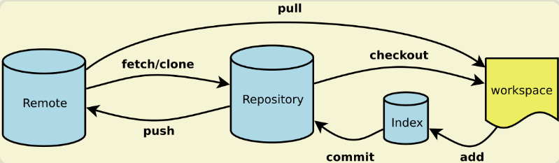

* 新建代码库
	* git init (在当前目录新建一个Git代码库)
	* git init [project-name] (新建一个目录，将其初始化为Git代码库)
	* git clone [url] (下载一个项目和它的整个代码历史)
* 增加文件
	* git add [file1] [file2] ...(添加指定文件到暂存区)
	* git add . 添加当前目录的所有文件到暂存区
* 提交代码
	* git commit -m [message] (提交暂存区到仓库区)
	* git commit [file1] [file2] ... -m [message] (提交暂存区的指定文件到仓库区)
	* git commit -a (提交工作区自上次commit之后的变化，直接到仓库区)
* 分支
	* git branch (列出所有本地分支)
	* git branch -r (列出所有远程分支)
	* git branch [branch-name] （新建一个分支，但依然停留在当前分支）
	* git checkout -b [branch] （新建一个分支，并切换到该分支）
	* git checkout [branch-name] （切换到指定分支）
* 查看信息
	* git status（显示有变更的文件）
	* git log （显示当前分支的版本历史）
	* git log -3 (显示过去3次提交)
* 远程同步
	* git fetch [remote] ( 下载远程仓库的所有变动)
	* git remote add [remote] [url]（增加一个新的远程仓库，并命名）
	* git pull [remote] [branch] (取回远程仓库的变化，并与本地分支合并)
	* git push [remote] [branch] (上传本地指定分支到远程仓库)

### Git实战 ###
* 使用Git命令从Github下载源码
* 使用Git命令

### Git GUI的使用 ###

### AS的Git插件使用 ###
1. 选择Git版本控制（菜单栏VCS -> Enable Version Control Integration -> Git）
2. 添加Git关联(重要)(Project->点右键->Git-> +Add)
3. 提交初始版本，并且选择远程仓库(重要)
4. 提交

### SourceTree的使用 ###

### Git Flow ###
> master分支

    master分支上存放的应该是随时可供在生产环境中部署的代码

> develop分支

	develop分支是保存当前最新开发成果的分支

> feature分支

	feature分支（有时也可以被叫做“topic分支”）通常是在开发一项新的软件功能的时候使用，
    这个分支上的代码变更最终合并回develop分支或者干脆被抛弃掉。一般从develop分支拉出
    feature分支，功能模块开发完之后合并到develop分支。

> release分支

	release分支是为发布新的产品版本而设计的。在这个分支上的代码允许做小的缺陷修正、准
	备发布版本所需的各项说明信息（版本号、发布时间、编译时间等等）。可以从develop分支派生，
	必须合并回develop分支和master分支

> hotfix分支

	当生产环境中的软件遇到了异常情况或者发现了严重到必须立即修复的软件缺陷的时候，就需要
	从master分支上派生hotfix分支来组织代码的紧急修复工作。必须合并回master分支和develop分支。


## Git服务器Gitblit搭建 ##
Git服务器：Github, Coding, CSDN Code

### 安装 ###
* gitblit属于绿色软件，解压即可使用

### 配置 ###
* 端口配置。打开解压后的文件目录，找到data下gitblit.properties文件，添加内容如下
	
	```
	server.httpPort = 8888
	server.httpsPort = 8889
	```
	> server.httpPort 指的是http的端口号，可以按照自己的需求随意设置
	> server.httpsPort 指的是https的端口号，可以按照自己的需求随意设置


* 安装和配置服务。（此方式安装后，以后服务会自动重启，不用再配置）
	* 安装：打开解压后的文件目录，找到 installService.cmd脚本文件，双击即可运行。
	* 检测是否已经安装成功：
		* 桌面 ---> 计算机---> 右键 ---> 管理
		 
		如果存在gitblit说明存在此服务。右键-->属性
		
		按图配置

## 使用Gitblit
### 登录
 打开浏览器输入 http://localhost:8888/ 可进入管理界面
	
 默认用户名: admin 和 密码: admin

  
### 仓库创建
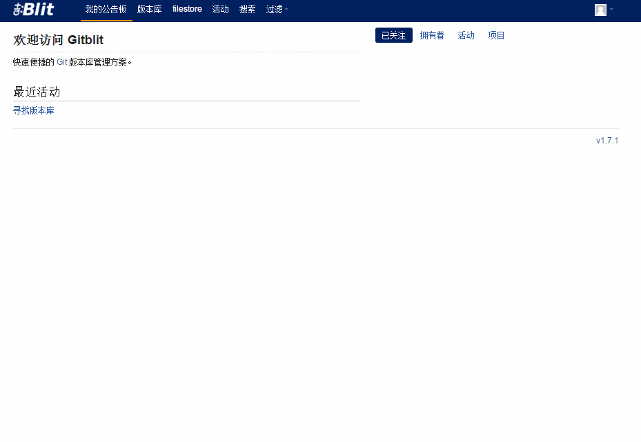

### 新建用户
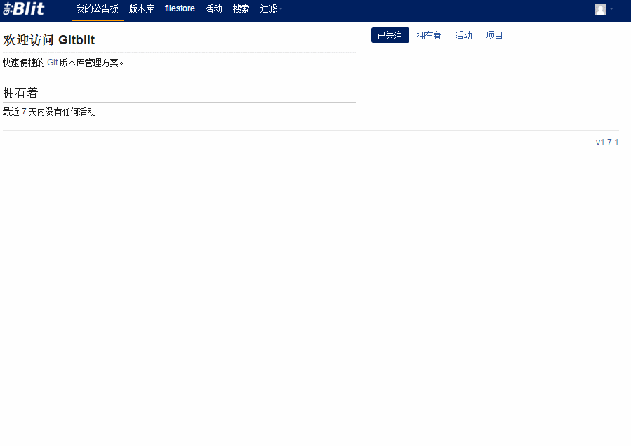

### 给仓库添加用户
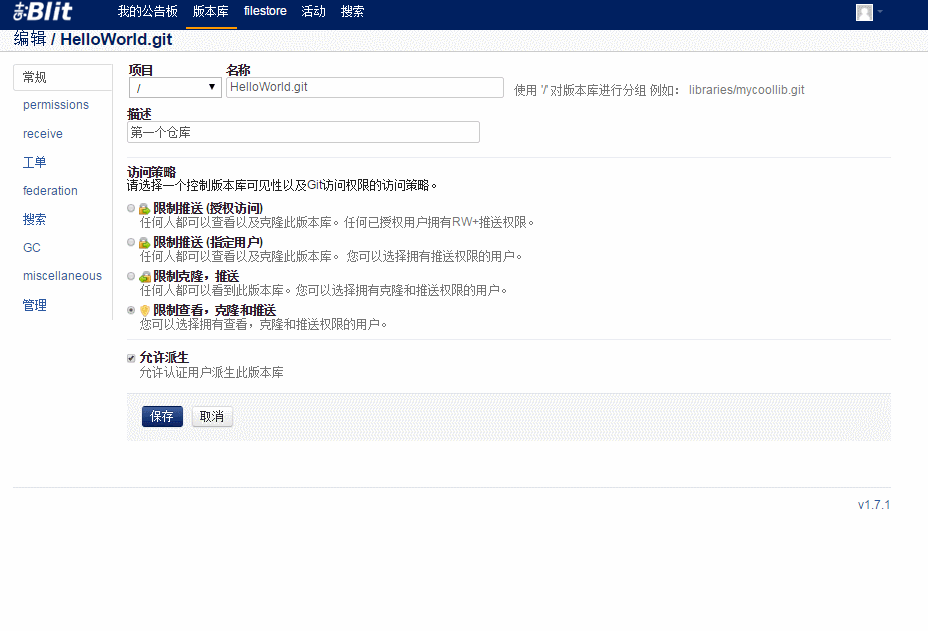

## 美女应用（AS项目实战）##
### 功能分析 ###
1. 分类列表
2. 图库列表
3. 图库详情
### API ###
* [百度APIStore](http://apistore.baidu.com/apiworks/servicedetail/992.html)
* API KEY 9cf5aecf1fd1c219a835903acca0f53b

## 多渠道打包 ##
渠道打包就是分不同的市场打包，比如安卓市场，百度市场，Google市场，360市场等等，太多了。分渠道打包目的是为了针对不同市场做出不同的一些统计，数据分析，收集用户信息。

1. 在AndroidManifest.xml里面application标签下声明：
	```<meta-data
    android:name="CHANNEL"
    android:value="${CHANNEL_VALUE}" />
	```
2. 在模块的build.gradle下声明：
```productFlavors {
 
	wandoujia {
		manifestPlaceholders = [CHANNEL_VALUE: "wandoujia"]
	}
 
	baidu {
	manifestPlaceholders = [CHANNEL_VALUE: "baidu"]
	}
 
	c360 {
	manifestPlaceholders = [CHANNEL_VALUE: "c360"]
	}
 
	tencent {
	manifestPlaceholders = [CHANNEL_VALUE: "tencent"]
	}
	
}
```
3. 获取meta data

```
    public void getChannel() {
        PackageManager pm = getPackageManager();
        try {
            PackageInfo packageInfo = pm.getPackageInfo(getPackageName(), PackageManager.GET_META_DATA);
            Bundle metaData = packageInfo.applicationInfo.metaData;
            String data = (String) metaData.get("CHANNEL");
        } catch (PackageManager.NameNotFoundException e) {
            e.printStackTrace();
        }
    }
```

## 测试用例 ##
### 官网介绍 ###
* [Best Practices for Testing](https://developer.android.com/training/testing/index.html)

### 单元测试 ###

### UI测试 ###
#### Espresso ####
 UI testing framework; suitable for functional UI testing within an app

* [官网介绍](https://developer.android.com/topic/libraries/testing-support-library/index.html#Espresso)

* [Espresso测试框架](https://google.github.io/android-testing-support-library/docs/espresso/setup/index.html)

* 相关依赖


* 相关注解	

	@SmallTest：测试代码中不与任何的文件系统或网络交互。
	@MediumTest：测试代码中访问测试用例运行时所在的设备的文件系统。
	@LargeTest：测试代码中访问外部的文件系统或网络。


* UI Automator：  UI testing framework; suitable for cross-app functional UI testing across system and installed apps

    [官网介绍](https://developer.android.com/topic/libraries/testing-support-library/index.html#UIAutomator)

* Gradle命令执行测试

	[官网](https://developer.android.com/studio/test/command-line.html)

	单元测试：gradle test
	UI测试: gradle cAT

## Debug调试 ##
 